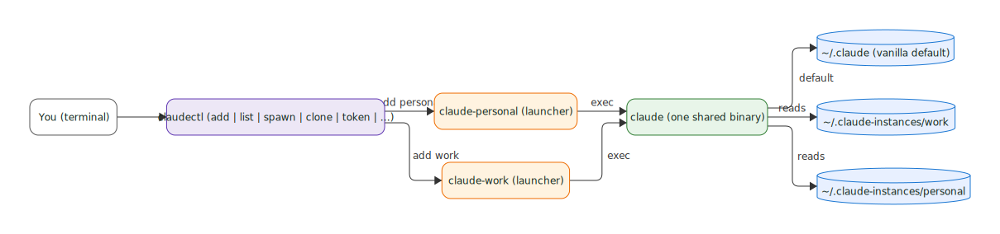

<p align="center">
  
</p>
<h1 align="center">claudectl</h1>
<p align="center">Manage isolated Claude Code instances — one binary, unlimited configurations.</p>
<p align="center">
  <a href="https://github.com/A-H-911/claudectl/actions/workflows/ci.yml">
    
  </a>
  
  
  
</p>

---

## Prerequisites

> **claudectl manages Claude Code instances, but Claude Code itself must be installed first.**
>
> Install Claude Code: **https://claude.ai/download** (Linux, macOS, Windows)
>
> After installing, verify: `claude --version`

---

## What is claudectl?

claudectl is a cross-platform CLI that creates and manages isolated Claude Code instances using
the `CLAUDE_CONFIG_DIR` environment variable. Each instance gets its own credentials, settings,
session history, and plugins — stored in a separate directory.

You get one `claude-<name>` launcher per instance. The real Claude Code binary is shared.
No copying, no duplication, no daemon.

---

## How it works

<p align="center">
  
</p>

`claudectl add <name>` creates **two things**: an isolated **config directory** (`chmod 700`) and a
thin **launcher** `claude-<name>`. The launcher *is* the entire isolation mechanism — it exports
`CLAUDE_CONFIG_DIR` pointing at that instance's directory, then `exec`s the **one shared `claude`
binary**, which therefore reads only that instance's credentials, settings, and history. `vanilla`
is the built-in default (`~/.claude`), used when you run `claude` directly. No copying, no daemon.

```
claudectl add work
# creates ~/.claude-instances/work/       (config dir, chmod 700)
# creates ~/.local/bin/claude-work        (thin launcher script)

claude-work
# launcher sets: CLAUDE_CONFIG_DIR=~/.claude-instances/work
# launcher exec: ~/.local/bin/claude "$@"
```

Each instance is fully independent — separate `/login`, separate history, separate settings.

---

## Known limitations

`CLAUDE_CONFIG_DIR` provides practical isolation but is not a perfect sandbox. As of Claude Code 2.x:

- `~/.claude/CLAUDE.md` global instructions may still load (GitHub #31649)
- LSP plugin installation sometimes writes to `~/.claude` (GitHub #57683)
- Skills directory sometimes reads from `~/.claude` (GitHub #15071)

**What IS reliably isolated:** credentials, settings, session history, standard plugins.

See [docs/architecture.md](docs/architecture.md) for full details and workarounds.

---

## Install claudectl

### Linux / macOS

```bash
git clone https://github.com/A-H-911/claudectl.git
cd claudectl
bash setup.sh
```

Or one-liner:

```bash
curl -fsSL https://raw.githubusercontent.com/A-H-911/claudectl/main/scripts/claudectl \
  -o ~/.local/bin/claudectl && chmod +x ~/.local/bin/claudectl
```

### Windows (PowerShell)

```powershell
git clone https://github.com/A-H-911/claudectl.git
cd claudectl
.\setup.ps1
```

See [docs/install.md](docs/install.md) for full install guide, CI/server setup, and updating.

---

## Quick start

```bash
# Create two instances
claudectl add work
claudectl add personal

# Authenticate each (Claude Code opens — run /login)
claude-work
claude-personal

# Check what you have
claudectl list
# NAME      CONFIG_DIR                              LOGGED_IN
# vanilla   /home/user/.claude                      yes
# work      /home/user/.claude-instances/work       yes
# personal  /home/user/.claude-instances/personal   yes

# Use them
claude-work      # opens Claude with work credentials
claude-personal  # opens Claude with personal credentials

# Done with an instance?
claudectl remove personal --purge --force
```

---

## Commands

| Command | Description |
|---------|-------------|
| `claudectl add <name>` | Create a new isolated instance |
| `claudectl list` | List all instances (`--json` for machine-readable) |
| `claudectl path <name>` | Print config directory (useful for scripting) |
| `claudectl reset <name>` | Wipe instance config, keep launcher |
| `claudectl remove <name>` | Remove launcher (`--purge` also removes config) |
| `claudectl spawn <name>` | Launch Claude Code for an instance |
| `claudectl status` | Show currently running Claude instances |
| `claudectl clone <src> <dst>` | Copy settings between instances |
| `claudectl config <name>` | Read/write `settings.json` for an instance |
| `claudectl token <name>` | Show credentials path and CI env var hint |
| `claudectl version` | Show claudectl and claude versions |
| `claudectl setup` | Verify install and configure PATH |

Run `claudectl help <command>` for detailed help on any command.

Full reference: [docs/commands.md](docs/commands.md)

---

## Usage examples

### 1. Separate work and personal instances

```bash
claudectl add work && claude-work       # /login with work account
claudectl add personal && claude-personal # /login with personal account
```

### 2. Clone settings to a new instance

```bash
claudectl add staging
claudectl clone work staging            # copies settings.json only
# staging must /login independently — credentials are never copied
```

### 3. Run a headless CI task

```bash
export CLAUDE_CODE_OAUTH_TOKEN=$(jq -r .oauthToken "$(claudectl path ci)/.credentials.json")
claudectl spawn ci -- --bare -p "summarize changes in this PR"
```

`--bare` skips hooks, LSP init, and plugin sync — recommended for scripted calls.

### 4. Open Claude in a specific project

```bash
claudectl spawn work --project ~/repos/myapp
```

### 5. Full teardown

```bash
claudectl remove myinstance --purge --force
```

See [docs/user-guide.md](docs/user-guide.md) for complete workflows.

---

## Platform support

| Platform | Status | Notes |
|----------|--------|-------|
| Linux | Supported | Full `status` attribution via `/proc` |
| macOS | Supported | `status` not available (no `/proc`) |
| Windows | Supported | Launchers are `.cmd` files; `status` shows PID+time only |

**Shells:** the scripts run under bash (any interactive shell works, as long as `bash` is installed).
`claudectl setup` wires PATH for **bash, zsh, sh, and fish**. See
[docs/platform-notes.md](docs/platform-notes.md) for per-platform details.

---

## Alternatives

| Tool | Approach | Best for |
|------|----------|----------|
| **claudectl** | Config-only isolation (`CLAUDE_CONFIG_DIR`) | Separate accounts, lightweight, cross-platform |
| [claude-squad](https://github.com/smtg-ai/claude-squad) | tmux + git worktrees | Long-running parallel sessions, complete process isolation |

---

## Troubleshooting

**Claude Code not found**
Install Claude Code first: https://claude.ai/download

**`claude-<name>: command not found`**
PATH not set. Run `claudectl setup` then open a new terminal.

**Instance not found**
Run `claudectl list` to see available instances.

**SSH non-interactive PATH**
Open a login shell (`ssh -t user@host bash --login`) or:
`ssh user@host "source ~/.bashrc && claudectl list"`

**Windows execution policy error**
```powershell
Set-ExecutionPolicy -Scope CurrentUser RemoteSigned
```

**`/login` required after add**
Each new instance starts unauthenticated. Run `claude-<name>` and complete `/login`.

---

## Contributing

`main` is protected: changes land via pull request and must pass CI on Linux, macOS, and Windows.
See [CONTRIBUTING.md](CONTRIBUTING.md).

## License

MIT — see [LICENSE](LICENSE).
